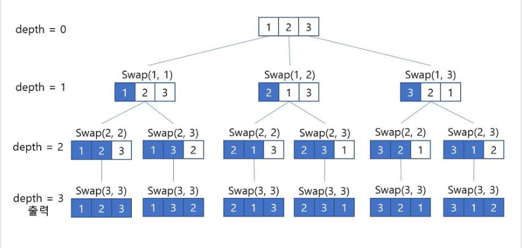

# 순열

순열 : n 개의 값 중에서 r 개의 숫자를 모든 순서대로 뽑는 경우

Ex)

[1, 2 3] 이라는 3개의 배열에서 2개의 숫자를 뽑는 경우

[1, 2]

[1, 3]

[2, 1]

[2, 3]

[3, 1]

[3, 2]

6 개가 만들어짐

## 알고리즘

swap 함수를 만들어 배열들의 값을 직접 바꾸는 방법

배열의 첫 값부터 순서대로 하나씩 바꾸며 모든 값을 한번씩 swap

depth를 기준으로 depth보다 인덱스가 큰 값들을 한번씩 swap

출처 : <https://bcp0109.tistory.com/14>

<pre><code>
// 사용법 : permutation(arr, 0, 5, 3)

static void permutation(char[] arr, int depth, int n, int r) {
        if(depth == r){
            print(arr, r);
            return;
        }

        for(int i=depth; i < n ; i++)
        {
            swap(arr, depth, i); // 현재 배열에서 depth 값과 i 값에 해당 인덱스 스왑
            permutation(arr, depth+1, n, r); // 스왑한 배열 출력 할때 까지 돌기
            swap(arr, depth, i); // 다 돌앗으면 다시 원상복귀
        }
    }

static void swap(char[] arr, int depth, int i){ // 뎁스와 i 값 스왑
        char temp = arr[depth];
        arr[depth] = arr[i];
        arr[i] = temp;
    }
</code></pre>

